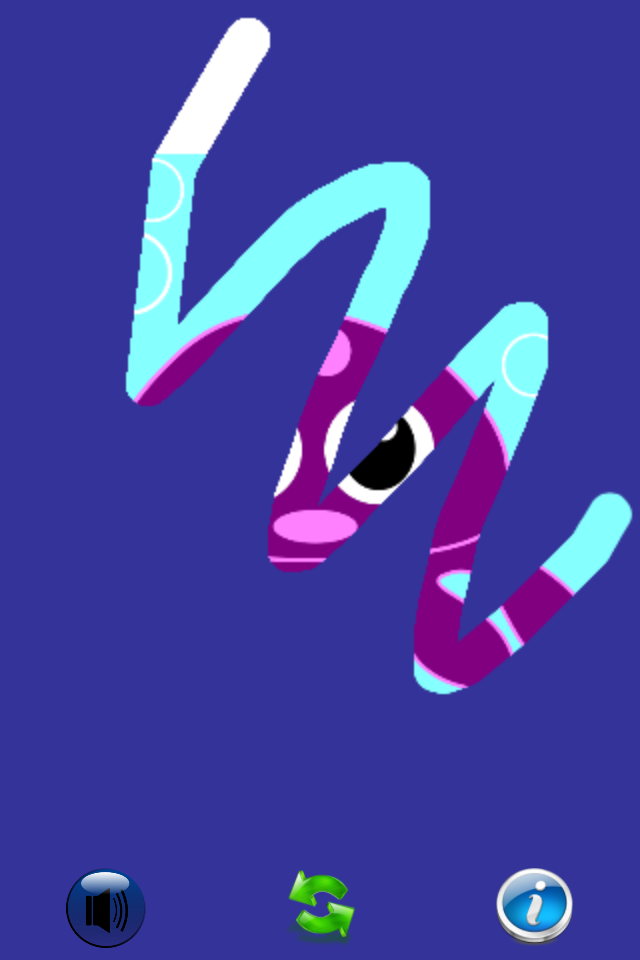

# EllieSoft
Part of an enormous collection of iOS apps, written in _Phonegap_ (aka _Cordova_).

## Background

  
PhoneGap

_PhoneGap_ was the framework which became _Cordova_ after it was acquired by _Adobe_.  This is essentially a
web page (_NSWebView_ on _iOS_) running locally.  _PhoneGap_ provides additional functionality to access
hardware on the host platform eg camera, pictures, contacts, but none of these apps needed that.

The main attraction of _PhoneGap_ is that it provides a reasonable way to develop cross-platform apps.
The downside is that not all native functionality is available or accessible.  Further, any UI is
constrained by what is available in a web page.  However, for the types of apps I was developing at the time, 
this was an acceptable compromise.

These were written c2008-c2011 and probably do not show the best practices for Javascript as I was just
learning Javascript and fumbling my way through.  However, in my defence,  "Shipping code trumps everything"!

## Apps

### Mega Picture Puzzles 
_**Please note that the images are deliberately low quality to reduce the size of the repository**_

'Mega Picture Puzzles' is a fun, puzzle app for children. Simply let your child scrape the screen to reveal a fun picture underneath. A huge selection of over 1000 colorful pictures will keep him or her entertained for hours. Each picture is totally random, so each time is a new surprise for your child.

'Mega Picture Puzzles' is a universal app, so it will work in native resolution on your iPhone, iPod Touch and iPad for the one price.

  
Screenshots

  
  

  

  

  

  

  

  

  

  

  

    

